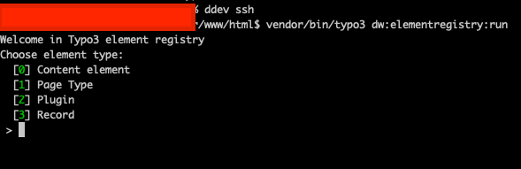

#  Typo3 element registry CLI
Create a new elements (like Content element, Page type, etc..) with CLI.


## Install
Install extension via composer `composer require digitalwerk/typo3-element-registry-cli` and activate it in Extension module


## Setup
After activating extension, you have to define your Vendor.
It can be this way:

1. By defining your Vendor in extension configuration (aka *extConf*).
**Example:** `Vendor`


## Creating a new element
To create new Element you have to just run command `dw:elementregistry:run` and follow instructions



## Command configuration
In `main_ext/Classes/CreateCommandConfig/CreateCommandCustomData`.
#### Traits and Classes
For example. This trait will be use:
                a) Element type must be `Content element`
                b) Field name must be `title`
                c) Element must be in `ExampleLorem` extension
```php
    /**
     * @return array
     */
    public function traitsAndClasses()
    {
        return [
            'titleTrait' => 'use Vendor\ExampleLorem\Traits\ContentElement\TitleTrait;',
        ];
    }
```

#### Override classes
If class string is empty, default class will be use.
```php
    public function overrideClasses() {
        return [
            'contentElementExtendClass' => '',
            'pageTypeInlineModelExtendClass' => 'Vendor\ExtName\Domain\Model\AbstractEntity',
        ];
    }
```
