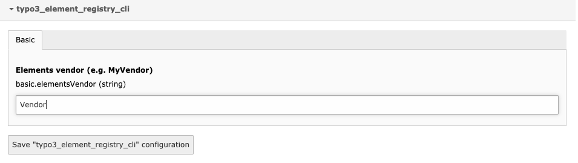

#  Typo3 element registry CLI
Create a new elements (like Content element, Page type, etc..) with CLI.

## Install
Install extension via composer `composer require digitalwerk/typo3-element-registry-cli` and activate it in Extension module

## Setup
After activating extension, you have to define your Vendor.
It can be this way:

1. By defining your Vendor in extension configuration (aka *extConf*).
**Example:** `Vendor`

